# IntelliJ plugin for Knative & Serverless Functons
[plugin-repo]: https://plugins.jetbrains.com/plugin/16476-knative-by-red-hat
[plugin-version-svg]: https://img.shields.io/jetbrains/plugin/v/16476-knative-by-red-hat.svg
[plugin-downloads-svg]: https://img.shields.io/jetbrains/plugin/d/16476-knative-by-red-hat.svg

[![JetBrains plugins][plugin-version-svg]][plugin-repo]
[![JetBrains plugins][plugin-downloads-svg]][plugin-repo]

## Overview

A JetBrains IntelliJ plugin for interacting with Knative & Serverless Functions. This plugin is currently in Preview Mode.

## New and Noteworthy

The plugin works by using `kn` CLI 1.3.1 and `func` CLI 0.23.1. 

### Invoke fuction

It is possible to invoke a local/remote function directly from the IDE

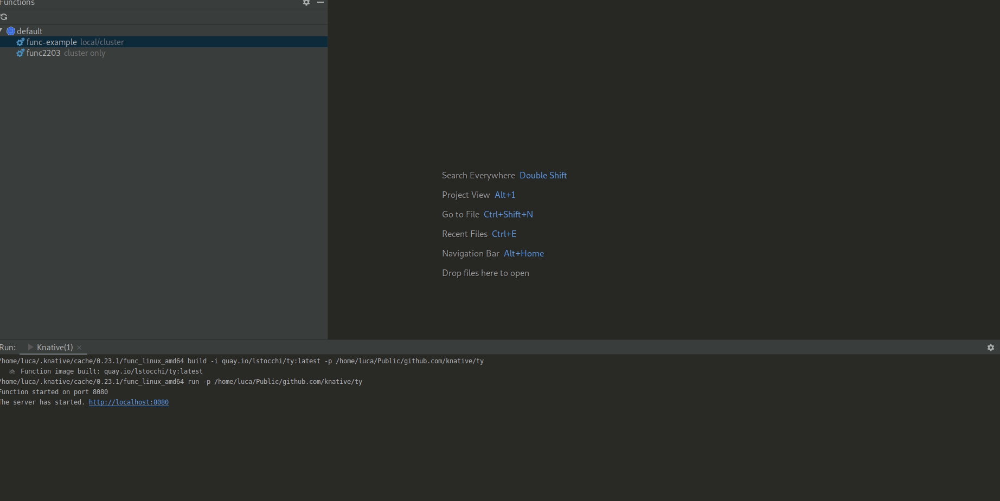

### Create new function enabled in all JetBrains IDE

The `New Function` action have been extended to all JetBrains IDEs

### Discovering existing CLIs and downloading missing ones have been improved

The CLIs needed for the plugin to work are now downloaded on background without freezing the IDE. 
It has also been enhanced the way already-installed CLIs are discovered.

### Known issues discovered by using `func` CLI 0.23.1

To overcome a visualization issue during the execution of the deploy command, this is run with the `-v` verbose flag [#974](https://github.com/knative-sandbox/kn-plugin-func/issues/974)

## Previous releases

### 1.0.0

The new release supports Knative Functions, enabling the development and deployment of Functions directly from IntelliJ.

### Create new function

The native IntelliJ `New Project/Module` actions have been extended to enable the creation of new functions.

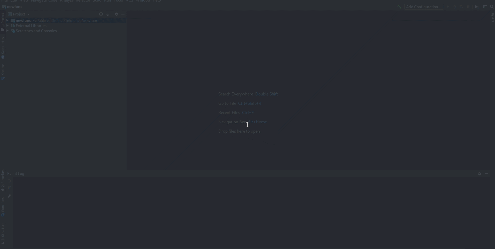

### New Functions View

A simplified view for Functions allows to easily build/run/configure/deploy your functions in few clicks.
It shows if the function has been deployed and available on cluster or only opened locally or both.

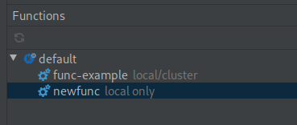

### Build/Run/Deploy Function

It is possible to build, deploy and run locally a function from the IDE. Textboxes and inputs will help through the entire workflow.

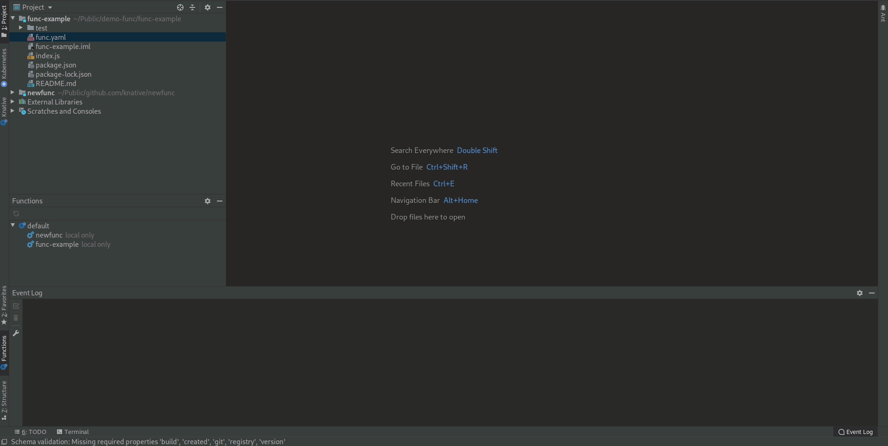

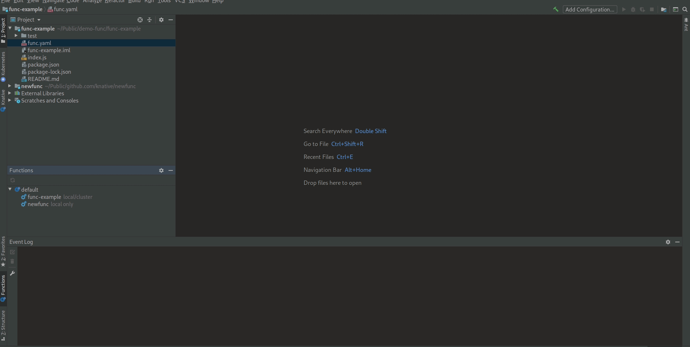

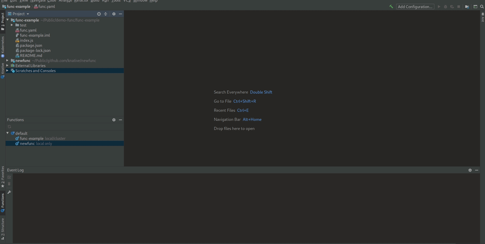

### Update Function Configuration

A function can be updated manually by changing the `func.yaml` file through the IDE editor. The plugin also provides
`add`/`remove` actions to configure environment variables and volumes in a guided way.

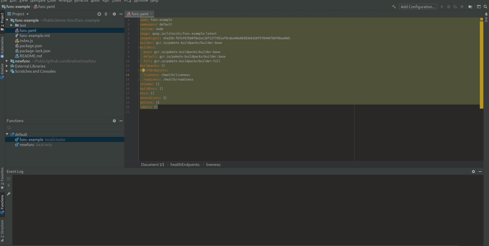

### Open in browser

Deployed Function can be opened in browser from the IDE.

### Undeploy Function

A deployed function can be undeployed.

### 0.1.0

This first release only support knative serving.

### Create new service

The plugin supports two ways to create a new service. A simplified view with textboxes/inputs to be filled in and an editor view for advanced settings.

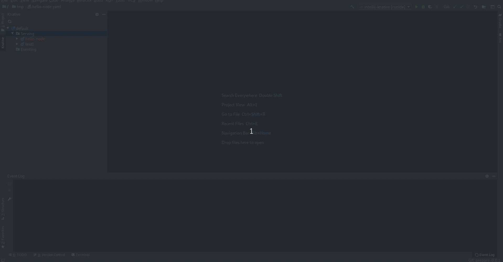

### Edit from the editor

Services can be opened in the editor and edit it from there. It offers code assist and syntax validation based on JSON schemas.

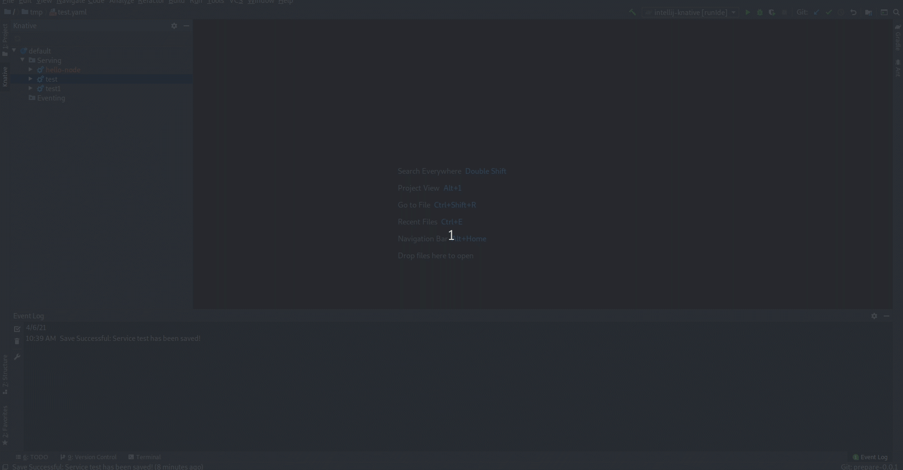

### Delete multiple elements

It is possible to delete several different elements, even if they are of different nature (ie services and revisions).

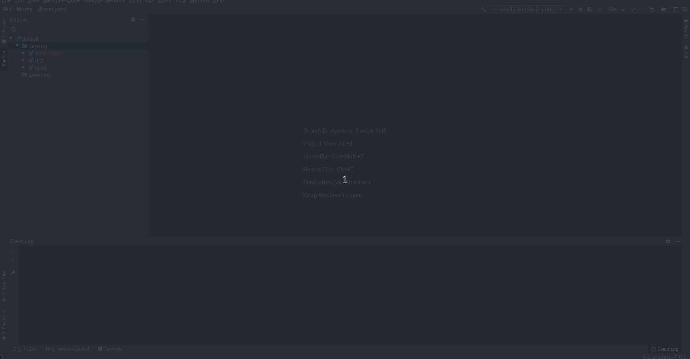

### Read only editor

Revisions are opened as read only in the editor.

### Shortcuts

Basic commands such as delete and refresh inherit and make use of shortcuts from IJ IDE.

### Open in browser

Services can be opened in browser from the IDE.

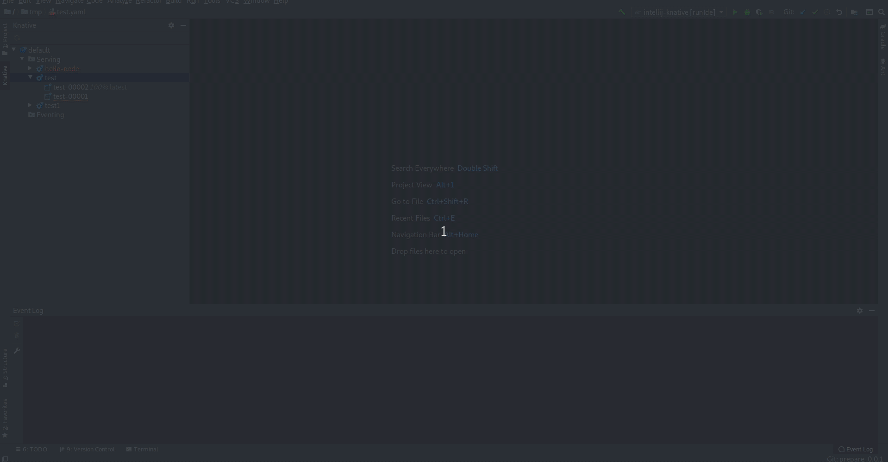

### Running Kubernetes and OpenShift Clusters to use with plugin

To use the plugin, developers can deploy Knative into a Red Hat CodeReady Containers or Minikube instance.

* OpenShift 4.x - [CodeReadyContainers](https://cloud.redhat.com/openshift/install/crc/installer-provisioned)
* Kubernetes - [Minikube](https://kubernetes.io/docs/tasks/tools/install-minikube/).

The plugin also supports OpenShift running on Azure, AWS.

## Knative Tutorial

To get started with Knative and learn how to easily deploy containers and manage events you can look at the official documentation:

* [Knative Docs](https://knative.dev/docs/)

## Commands and features

Development of the Knative Plugin is largely following development of the [kn CLI](https://github.com/knative/client) and 
[func CLI](https://github.com/knative-sandbox/kn-plugin-func) as well as
Knative serving and Knative eventing which are both under active development and potentially subject to drastic changes.

Below you can find a list of the current actions supported by this plugin to interact with Knative.
These are accessible via the context menu when right-clicking an item in the tree.

#### Actions available

##### Knative

* `New Service` - Open a wizard with two tabs (simplified and editor) to create a new knative service (only available for Service).
* `Open in Editor` - Open the existing service/revision configuration in an editor.
* `Delete` - Delete the selected services/revisions.
* `Refresh` - Refresh the selected item
* `Open in Browser` - Open a browser using the service URL (only available for Service)

##### Knative Function

* `New Function` - Extend the native IntelliJ `new Project/Module` action to enable the creation of a new knative function.
* `Build` - Build a function
* `Run` - Run a function locally. This action is disabled if the function has not been built.
* `Deploy` - Build and deploy a function to a cluster. The image built will be pushed to a registry. If the registry is private it will ask to authenticate
* `Open in Browser` - Open a browser using the function URL
* `Add/Remove Configuration` - Allow to update function configuration in a guided way (it supports environment variables and volumes)
* `Undeploy` - Undeploy a function which has been deployed previously

##### Saving Process

The plugin takes advantage of the normal saving workflow of the IntelliJ IDE. When you finish to edit your configuration
and want to push the changes to the cluster, click on `Save All (CTRL + S)`. A prompt will be shown asking if you want to push the changes.

### Dependencies

#### CLI Tools

This plugin uses two CLI tools to interact with Knative:
* Knative CLI - [kn](https://github.com/knative/client)
* Func CLI - [func](https://github.com/knative-sandbox/kn-plugin-func)

> The plugin will detect these dependencies and prompt the user to install if they are missing or have not supported version - choose `Download & Install` when you see an notification for the missing tool.

**NOTE:** This plugin is in Preview mode. The plugin support for Knative is strictly experimental - assumptions may break, commands and behavior may change!

## Release notes

See the change log.

Contributing
============
This is an open source project open to anyone. This project welcomes contributions and suggestions!

For information on getting started, refer to the [CONTRIBUTING instructions](CONTRIBUTING.md).

Feedback & Questions
====================
If you discover an issue please file a bug and we will fix it as soon as possible.
* File a bug in [GitHub Issues](https://github.com/redhat-developer/intellij-knative/issues).

License
=======
EPL 2.0, See [LICENSE](LICENSE) for more information.
