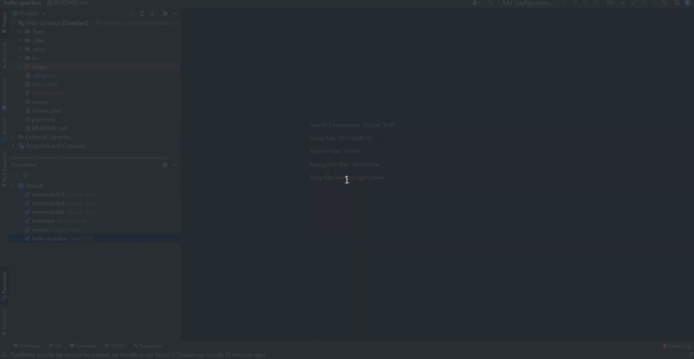
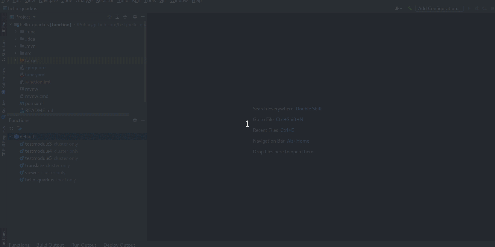
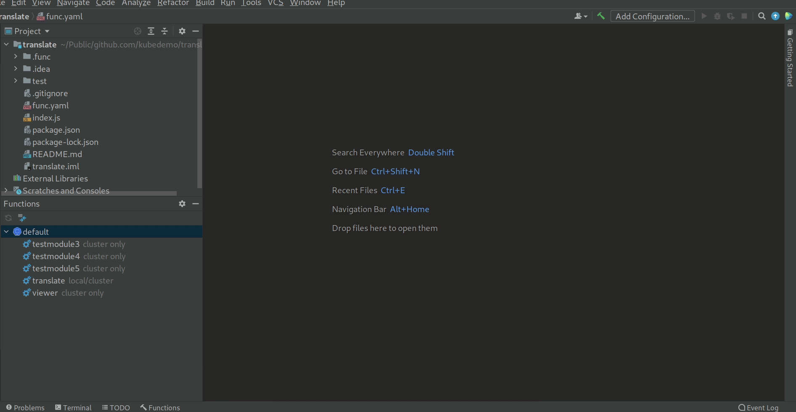
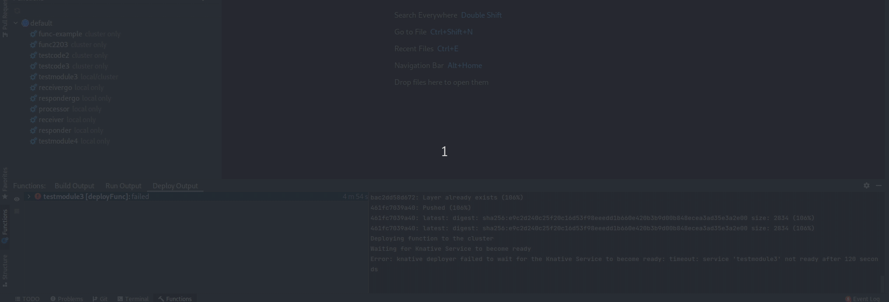
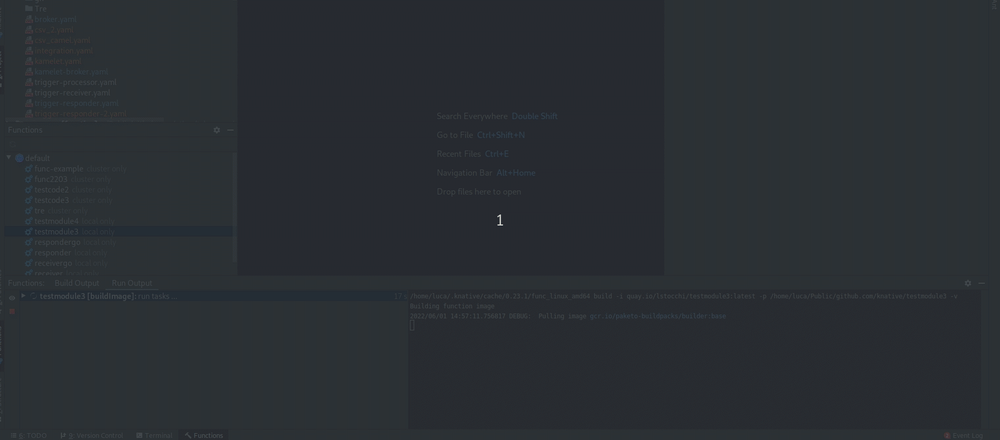

# IntelliJ plugin for Knative & Serverless Functions

[Knative](https://knative.dev/docs/) is an Open-Source Enterprise-level solution to build Serverless and Event Driven Applications. Thus running Serverless Containers in Kubernetes environments.

This JetBrains IntelliJ plugin provides the app developer the tools and experience needed when working with `Knative & Serverless Functions` on a Kubernetes cluster. Using this extension, developers can develop and deploy functions in a serverless way through guided IDE workflow.

The minimum JetBrains IDEs version supported by the plugin has been increased to 2021.1
The plugin works by using `kn` CLI 1.7.0 and `func` CLI 1.8.0

### On-Cluster Build

On-Cluster Build allows building (and deploying) the source code stored in a git repository within the cluster by leveraging Tekton.
Now it is possible to start an on-cluster build from the IDE. The action is enabled when Knative and Tekton are
both installed on the cluster. The plugin interacts with the JetBrains git plugin to guide the user through the entire process.

### Manage Function repos

The plugin provides a custom dialog to add and remove new Function repositories. They can be used to create a new function
using a template stored in them.

### Getting Started Page

A getting started page has been added to explain the different features the plugin offers and shows how to use them.

### New ToolWindow for build/deploy/run actions

- The plugin now provides a custom ToolWindow to showcase the command execution
- This currently supports the execution of the Run, Build and Deploy Function command
- It also supports History View to visualise the old command logs
- Currently, users can only view _the last 10 logs_ of the associated Function command

### Stop function execution and limit running sessions

It is possible to stop a running function execution directly from the IDE UI.

### Smarter workflow execution

The plugin skips building a function if it has not been updated since last build.

### Inform user if the function is not running when invoking it

The user is prompted to run the function first before invoking it, if the function is not running. This improves the overall experience during invoke calls.

### Invoke fuction

It is possible to invoke a local/remote function directly from the IDE

### Create new function

The native IntelliJ `New Project/Module` actions have been extended to enable the creation of new functions.

### New Functions View

A simplified view for Functions allows to easily build/run/configure/deploy your functions in few clicks.
It shows if the function has been deployed and available on cluster or only opened locally or both.

### Build/Run/Deploy Function

It is possible to build, deploy and run locally a function from the IDE. Textboxes and inputs will help through the entire workflow.

### Update Function Configuration

A function can be updated manually by changing the `func.yaml` file through the IDE editor. The plugin also provides
`add`/`remove` actions to configure environment variables and volumes in a guided way.

### Create new service

The plugin supports two ways to create a new service. A simplified view with textboxes/inputs to be filled in and an editor view for advanced settings.

### Edit from the editor

Services can be opened in the editor and edit it from there. It offers code assist and syntax validation based on JSON schemas.

### Delete multiple elements

It is possible to delete several different elements, even if they are of different nature (ie services and revisions).

### Open in browser

Services can be opened in browser from the IDE.

### Running Kubernetes and OpenShift Clusters to use with plugin

To use the plugin, developers can deploy Knative into a OpenShift or Kubernetes cluster. OpenShift clusters can be provisioned using the following ways:

* [OpenShift Local](https://developers.redhat.com/products/openshift-local/overview)
* [Developer Sandbox for Red Hat OpenShift](https://developers.redhat.com/developer-sandbox)
* [Red Hat OpenShift Cluster Manager](https://console.redhat.com/openshift/create/datacenter) - This 60-day, self-supported trial lets you install and run Red Hat OpenShift Container Platform on infrastructure you manage.
* [Red Hat OpenShift Dedicated](https://console.redhat.com/openshift/create/osdtrial) - Red Hat OpenShift Dedicated is a fully managed service of Red Hat OpenShift on Amazon Web Services (AWS) and Google Cloud.
* [Azure Red Hat OpenShift](http://red.ht/3oeVPjM) - Azure Red Hat OpenShift is a fully-managed service of Red Hat OpenShift on Azure, jointly engineered, managed and supported by Microsoft and Red Hat.
* [Red Hat OpenShift Service on AWS (ROSA)](https://console.redhat.com/openshift/create/rosa/wizard) - Build, deploy, and manage Kubernetes applications with Red Hat OpenShift running natively on AWS.

## Knative Tutorial

To get started with Knative and learn how to easily deploy containers and manage events you can look at the official documentation:

* [Knative Docs](https://knative.dev/docs/)

## Commands and features

Development of the Knative Plugin is largely following development of the [kn CLI](https://github.com/knative/client) and
[func CLI](https://github.com/knative-sandbox/kn-plugin-func) as well as
Knative serving and Knative eventing which are both under active development and potentially subject to drastic changes.

Below you can find a list of the current actions supported by this plugin to interact with Knative.
These are accessible via the context menu when right-clicking an item in the tree.

#### Actions available

##### Knative

* `New Service` - Open a wizard with two tabs (simplified and editor) to create a new knative service (only available for Service).
* `Open in Editor` - Open the existing service/revision configuration in an editor.
* `Delete` - Delete the selected services/revisions.
* `Refresh` - Refresh the selected item
* `Open in Browser` - Open a browser using the service URL (only available for Service)

##### Knative Function

* `New Function` - Extend the native IntelliJ `new Project/Module` action to enable the creation of a new knative function.
* `Build` - Build a function
* `Run` - Run a function locally. This action is disabled if the function has not been built.
* `Deploy` - Build and deploy a function to a cluster. The image built will be pushed to a registry. If the registry is private it will ask to authenticate
* `Open in Browser` - Open a browser using the function URL
* `Add/Remove Configuration` - Allow to update function configuration in a guided way (it supports environment variables and volumes)
* `Undeploy` - Undeploy a function which has been deployed previously

##### Saving Process

The plugin takes advantage of the normal saving workflow of the IntelliJ IDE. When you finish to edit your configuration
and want to push the changes to the cluster, click on `Save All (CTRL + S)`. A prompt will be shown asking if you want to push the changes.

### Dependencies

#### CLI Tools

This plugin uses two CLI tools to interact with Knative:
* Knative CLI - [kn](https://github.com/knative/client)
* Func CLI - [func](https://github.com/knative-sandbox/kn-plugin-func)

> The plugin will detect these dependencies and prompt the user to install if they are missing or have not supported version - choose `Download & Install` when you see an notification for the missing tool.

## Release notes

See the [release notes](https://github.com/redhat-developer/intellij-knative/releases).

Contributing
============
This is an open source project open to anyone. This project welcomes contributions and suggestions!

For information on getting started, refer to the [CONTRIBUTING instructions](CONTRIBUTING.md).

Feedback & Questions
====================

If you discover an issue please file a bug and we will fix it as soon as possible.
* File a bug in [GitHub Issues](https://github.com/redhat-developer/intellij-knative/issues).
* Open a [Discussion on GitHub](https://github.com/redhat-developer/intellij-knative/discussions).

The func Task Force meets @ 10:30 PST every Tuesday, we'd love to have you! For more information, see the invitation on the [Knative Team Calendar](https://calendar.google.com/calendar/u/0/embed?src=knative.team_9q83bg07qs5b9rrslp5jor4l6s@group.calendar.google.com).

License
=======
EPL 2.0, See [LICENSE](LICENSE) for more information.
