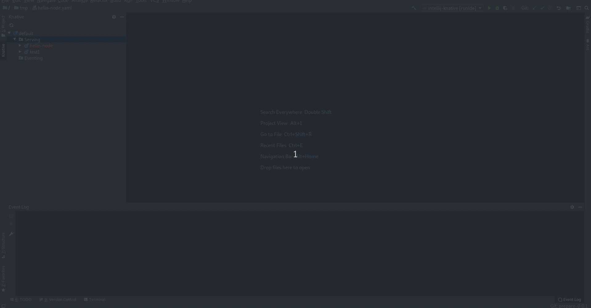
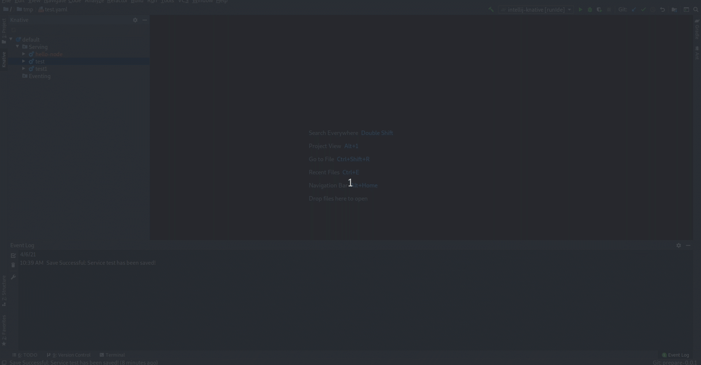
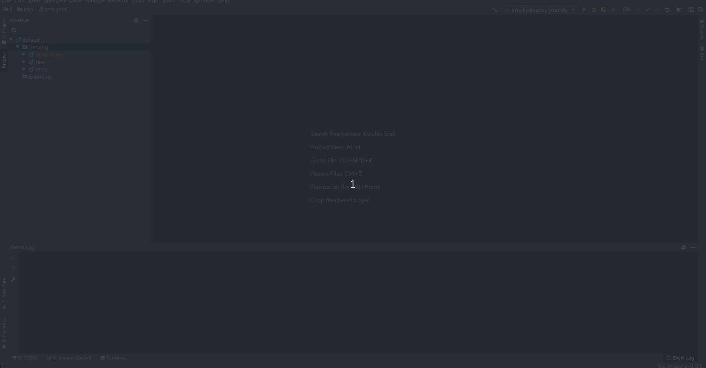
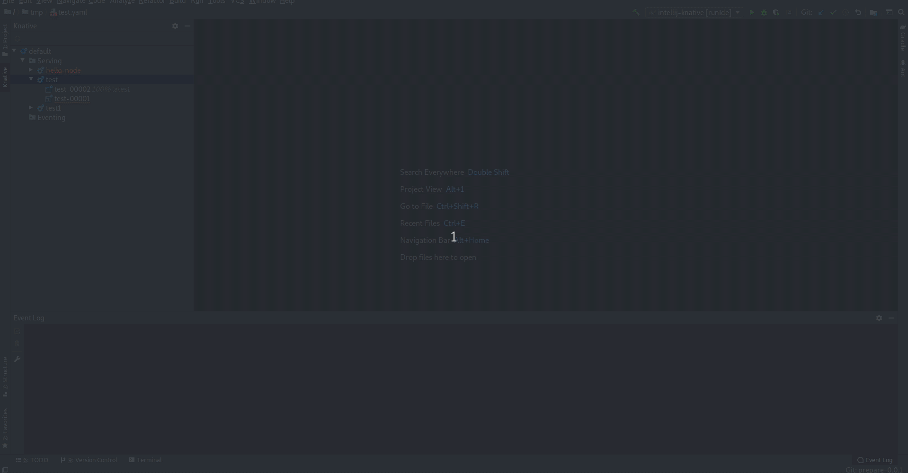

# IntelliJ Knative

## Overview

A JetBrains IntelliJ plugin for interacting with Knative. This plugin is currently in Preview Mode.

## New and Noteworthy

This first release only support knative serving.

### Create new service

The plugin supports two ways to create a new service. A simplified view with textboxes/inputs to be filled in and an editor view for advanced settings.

### Edit from the editor

Services can be opened in the editor and edit it from there. It offers code assist and syntax validation based on JSON schemas.

### Delete multiple elements

It is possible to delete several different elements, even if they are of different nature (ie services and revisions).

### Read only editor

Revisions are opened as read only in the editor.

### Shortcuts

Basic commands such as delete and refresh inherit and make use of shortcuts from IJ IDE.

### Open in browser

Services can be opened in browser from the IDE.

### Running Kubernetes and OpenShift Clusters to use with plugin

To use the plugin, developers can deploy Knative into a Red Hat CodeReady Containers or Minikube instance.

* OpenShift 4.x - [CodeReadyContainers](https://cloud.redhat.com/openshift/install/crc/installer-provisioned)
* Kubernetes - [Minikube](https://kubernetes.io/docs/tasks/tools/install-minikube/).

The plugin also supports OpenShift running on Azure, AWS. 

## Knative Tutorial

To get started with Knative and learn how to easily deploy containers and manage events you can look at the official documentation:

* [Knative Docs](https://knative.dev/docs/)

## Commands and features

Development of the Knative Plugin is largely following development of the [kn CLI](https://github.com/knative/client) as well as 
Knative serving and Knative eventing which are both under active development and potentially subject to drastic changes.

Below you can find a list of the current actions supported by this plugin to interact with Knative. 
These are accessible via the context menu when right-clicking an item in the tree.

#### Actions available

   * `New Service` - Open a wizard with two tabs (simplified and editor) to create a new knative service (only available for Service).
   * `Open in Editor` - Open the existing service/revision configuration in an editor.
   * `Delete` - Delete the selected services/revisions.
   * `Refresh` - Refresh the selected item
   * `Open in Browser` - Open a browser using the service URL (only available for Service)

##### Saving Process

The plugin takes advantage of the normal saving workflow of the IntelliJ IDE. When you finish to edit your configuration
and want to push the changes to the cluster, click on `Save All (CTRL + S)`. A prompt will be shown asking if you want to push the changes.

### Dependencies

#### CLI Tools

This plugin uses a CLI tool to interact with Kntive:
* Knative CLI - [kn](https://github.com/knative/client)

> The plugin will detect these dependencies and prompt the user to install if they are missing or have not supported version - choose `Download & Install` when you see an notification for the missing tool.

**NOTE:** This plugin is in Preview mode. The plugin support for Knative is strictly experimental - assumptions may break, commands and behavior may change!

## Release notes

See the change log.

Contributing
============
This is an open source project open to anyone. This project welcomes contributions and suggestions!

For information on getting started, refer to the [CONTRIBUTING instructions](CONTRIBUTING.md).

Feedback & Questions
====================
If you discover an issue please file a bug and we will fix it as soon as possible.
* File a bug in [GitHub Issues](https://github.com/redhat-developer/intellij-knative/issues).

License
=======
EPL 2.0, See [LICENSE](LICENSE) for more information.